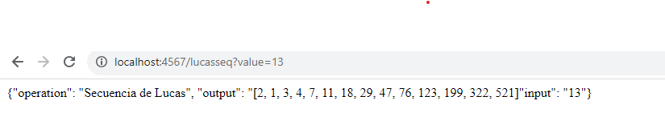

Intenté subirlo a AWS, pero por cuestiones de tiempo no logré correrlo exitosamente. En el repositorio hay un video que muestra las 3 máquinas instanciadas, 2 de ella corriendo (una no me dejó instalar maven)

Links de los videos:

- https://pruebacorreoescuelaingeduco-my.sharepoint.com/:v:/g/personal/juan_fonseca-c_mail_escuelaing_edu_co/ETD8eDrqkW1KjmPkn3J2xFEBfvsPGTt000LWGTWU2JZc0A?e=zljCnO

- https://pruebacorreoescuelaingeduco-my.sharepoint.com/:v:/g/personal/juan_fonseca-c_mail_escuelaing_edu_co/EdimpiP4LeZJsqWVwyLY-bkBKr1461dZxs4B6WYtjpSL5w?e=sEmzt9

Ya tiene funcionando round robin el proxy, sin embargo las URL quedaron pegadas